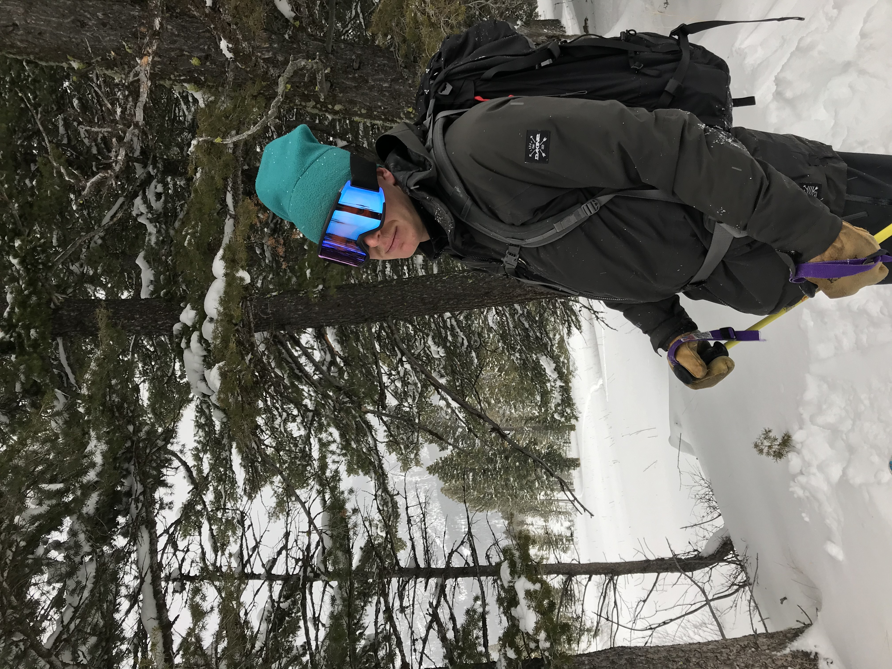

# John Schafer

## About Me

I am a Systems Engineering Masters student at UC Berkley focusing on power system engineering. Originally from Montana, I have a specific interest in decarbonization / renewable energy projects in the inter-mountain west. My work primarily is focused on the control and automation of different nuclear/SMR systems and exploring avenues to increase their value and utilization in the grid. 

## Resume
[Resume](john_schafer_resume_kairos_2024.pdf)

## Education

### University of California, Berkeley
_Graduation May 2024_  
**Master of Science in Systems Engineering, Civil & Environmental Engineering**, GPA: 3.715  
Berkeley, CA

### Montana State University, Honors College
_2021_  
**Bachelor of Science in Applied Mathematics**, GPA: 4.00  
Bozeman, MT

### Montana State University, Honors College
_2021_  
**Bachelor of Arts in Political Science**, GPA: 3.98  
Bozeman, MT

## Projects

### Control of Cogeneration in Small Modular Reactors to Enable Load Following
Comparing Model Predictive Control versus PI control to manipulate the relative cogneration of electricity/heat in a nuclear cogneration facility in order to effectively load follow in a highly renewable pentrated microgrid setting.

[nuclear_cogeneration_report.pdf](nuclear_cogeneration_report.pdf)

### EV Charging Behavior Analysis and Identification for V2G Utilization
Analyzing the EV charging behavior of users in LA to identify different groups of "like" charging behaviors in order to inform V2G decision making.

[v2G_charging_behavior_report.pdf](263_final_project_v2g.pdf)

---

Outside of my professional aspirations, there is nothing better than skiing, biking and diesel trucks!

More Information:
- [LinkedIn](https://www.linkedin.com/in/john-schafer-5a3271204/)
- [GitHub](https://github.com/johnschafer406)

[Contact Me](mailto:john_schafer@berkeley.edu)

