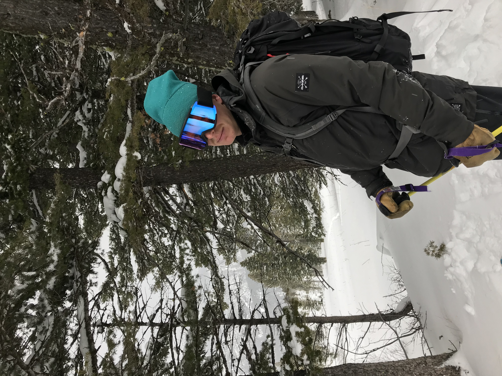

# John Schafer

## About Me

I'm an energy systems engineer who turns ambitious ideas into reality. From founding SOLV's CHIL testing lab to developing next-gen control systems, I thrive at the intersection of deep technical work and entrepreneurial execution. I don't just solve problems - I build the programs, teams, and systems that solve them at scale. 

Originally from Montana, I focus on **decarbonization and renewable energy projects** in the Western US. My work centers on the control and automation of renewable energy systems including nuclear, microgrids, battery energy storage, and vehicle-to-grid applications.

Currently exploring opportunities in **power systems controls** and **energy system optimization**.

## Experience

**Test and Simulation Engineer** | *SOLV Energy* | 2024-Present  
Pioneered SOLV's CHIL test lab from platform selection through full software Factory Acceptance Tests. High-fidelity modeling of PV and BESS sites using PSS/E and PSCAD for real-time control via SEL RTAC systems.

**Critical Infrastructure Analyst** | *Lawrence Livermore National Laboratory* | Summer 2024  
Graduate internship in the Cyber and Critical Infrastructure Summer Institute. Developed Python/MATLAB solutions to increase power system infrastructure resiliency within national security contexts.

**Solutions Consultant** | *commonFont* | 2021-2022  
Led technical implementation of SaaS platforms and BI tools for enterprise clients using JavaScript, HTML, and AWS. Headed dynamic team consulting on machine learning and data-driven business strategies.

## Education

**University of California, Berkeley** | *2024*  
Master of Science in Systems Engineering, Civil & Environmental Engineering, GPA: 3.8  

**Montana State University, Honors College** | *2021*  
Bachelor of Science in Applied Mathematics, GPA: 4.00  
Bachelor of Arts in Political Science, GPA: 3.98  

## Technical Skills

**Power Systems**: SCADA, HIL Testing, Typhoon HIL, PLCs, SEL RTAC, Power Flow Simulation, DNP3/Modbus  
**Programming**: Python, MATLAB/Simulink, PSS/E, PSCAD, CVXPY, TensorFlow, Git  
**Optimization**: Convex Optimization, Model Predictive Control, Reinforcement Learning  

## Featured Projects

### Vehicle-to-Grid (V2G) Scheduling using Reinforcement Learning
Developed custom Deep Q-Learning and Actor-Critic models to optimize V2G scheduling within a microgrid. Demonstrates advanced RL applications for energy management systems.

[V2G_RL_report.pdf](V2G_Reinforcement_Learning_Report.pdf) | [GitHub](https://github.com/johnschafer406/V2G_Reinforcement_Learning)

### Control of Cogeneration in Small Modular Reactors to Enable Load Following
Compared Model Predictive Control vs PI control for managing electricity/heat generation balance in nuclear cogeneration facilities, enabling effective load following in high renewable penetration microgrids.

[nuclear_cogeneration_report.pdf](290I_Final_Paper (1).pdf) | [GitHub](https://github.com/johnschafer406/SMR_nuclear_cogeneration_control)

### Multiperiod Robust Optimal Power Flow and Model Predictive Control
Evaluated MPC and Robust Optimization methods for optimal power flow in microgrids using IEEE 39-bus system. Demonstrated MPC's superior performance in managing renewable energy integration and minimizing diesel generation dependency.

[OPF_MPC_report.pdf](OPF_report.pdf) | [GitHub](https://github.com/carlacupcake/CE295-OPF)

### EV Charging Behavior Analysis and Identification for V2G Utilization
Analyzed EV charging patterns in Los Angeles to identify user behavior clusters, informing V2G decision-making algorithms and grid integration strategies.

[v2G_charging_behavior_report.pdf](263_final_project_v2g.pdf) | [GitHub](https://github.com/johnschafer406/v2g_charging_behavior)

---

## Resume
[Download Resume](resume_CHIL_2025.pdf)

---

Outside of professional work, there's nothing better than skiing, biking, and working on trucks!

**Connect:**
- [LinkedIn](https://www.linkedin.com/in/john-schafer-5a3271204/)
- [GitHub](https://github.com/johnschafer406)
- [Email](mailto:johnschafer406@gmail.com)
